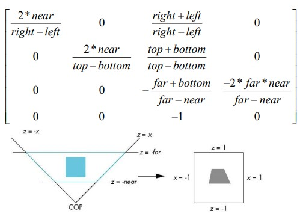

# Eksamen grafikk 2019
Presentere på eksamen:
* Vise "forklaringsvilje"
* Presentere ovenfra og ned:
    * Fordel å starte med å si noe generelt, anvendelse osv. Før detaljer
* God innsikt og struktur
* Bruke riktige begrep.
### Les godt på
* Teorien er ofte mangelfullt besvart hos noen, jobbet for lite med dette? Kunne begrepene!
* WebGL- eksempler/øvinger kunne forklare kode og relatere til teori
* Threejs: Kunne forklare kode, vite med gang hvor de ulike metodene er realisert


## Tema
* Transformasjoner - kunne matrisene
* Transformasjonsmatriser
* Hierarkisk modell
* Koordinatsystemer
* WebGl
* Samlebånd (pipeline) - kunne stegene
* Shaderspråk - GLSL
* Shader
* Tekstur
* Magnification og minification
* Texture-sampling
* Konstruksjon av mipmap
* Konfigurere tekstur
* Fragment shader
* Kort om FBO-datastruktur
* FBO anvendelse
* Ping ponging
* Diffuse
* Kamerabevegelser
* Solsystemet WebGL
* Threejs
* Solsystemet Threejs
* Normal transform
* General Rotation using quaternion
* Instansiering
* Aliasing(undersampling) og antialiasing
* Depth of field
* Fargesystemer
* Kamerasystem
* Projeksjoner
* Klipping
* Sysnport transformasjon
* Rasterering ved interpolasjon
* Shading
* Phongs refleksjonsmodell
* Refleksjonsformer
* Bruk av halvvektor
* Speilrefleksjon
* Trekantnormal og vertex-normal
* Polygonshading
* Gouraud og Phon-shading
* Pr. Vertex- shading - Pr. Fragment- shading
* Smooth shading
* Shadow mapping
* Environment mapping
* Cube environment mapping
* Cube mapping
* Dynamic cube mapping
* Bump mapping
* Normal mapping
* Tangent space normal mapping
* Tangentrommet
* Shaderkode. Fortsettelse vertex-shader
* Akselerasjonsalgoritmer
* Scenegraf
* LOD(level of detail)
* Ulike culling-teknikker
* Datastruktur for synlighet

## Transformasjoner

* Translation
* Scaling
* Rotation
* Shearing

* In homogene coordinates
* p' = Cp
* We will study vertex transformation and normal transformation


### Other transformation
* Reflection
* Normal Transformation

### Translation
* Every point (or vector) will be displaced the same distance in the same direction
* (x,y,z) -> (x + dx, y + dy, z + dz)


### Scaling
* (x,y,z) -> (SxX, SyY, SzZ)
* 0 < Sx, Sy, Sz scaling factors
* 0 < Sx, Sy, Sz < 1 reduce and Sx, Sy, Sz > 1 enlarge
* Uniform scaling if Sx = Sy = Sz, otherwise nonuniform
* We did not say to scale points (but scale a object), but it happens something with the object

* In homogene coordinates
* p' = Sp
* S = (Sx, Sy, Sz)

### Rotation


* Inverse rotation
* R(Omega)^-1 = R(-Omega) = R(Omega)^T

Rotation matrices are orthonormal, so we can easily find the inverse rotation matrix.

### Concatenations of transforms
* We can group the transformation matrices to a composite matrix C
* Ex: We do this sequence (time line)
1. Scaling
2. Rotate
3. Translate
* TRSp = (T(R(Sp)))

We can then first calculate C = TRS and then multiply p' = Cp

* The matrix concatenation is order-dependent as illustrated (SR!=RS)

Two scales, and two translations commute. Two rotations commute for the same axes. Scales and rotations commute only for
uniform scaling. For arbitrary matrices: AB!=BA.

### Reflection

Corresponds to negative scale factors, so mirrored to the left or right is Sx = -1, Sy = 1. If it's under Sx = 1, Sy = -1.
Down and one to the sides is Sx = -1, Sy = -1.

* 2D - Reflection about an axis
* 3D - reflection about a plane

### Shearing (By leaning a shape)
* Applications:
    * Fonts
    * To give special effects in games
    * Special projections
    
Helpful to add one more basic transformation. Equivalent to pulling faces in opposite directions.

* x' = x + ytan(Theta)
* y' = y

In **3D** the volume is preserved under transformation.

### Concatenation
* We can form arbitrary affine transformation matrices by multiplying together rotation, translation, and scaling 
matrices
* Because the same transformation is applied to many vertices, the cost of forming a matrix M=ABCD is not significant
compared to the cost of Mp for many vertices p
* The difficult part is how to form a desired transformation from the specifications in the application.
* Concatenation is usually solved p'=ABCp = A(B(Cp))
* Many references use column matrices to represent points in terms of column matrices. p' = pCBA with every individual 
transformation powered in T

### Rotation about the origin
A rotation by big Theta about an arbitrary axis can be decomposed into the concatenation of rotations about the x, y, 
and z

Rotate z-axis: R(Theta) = Rx(-Thetax)Ry(-Thetay)Rz(Theta)Ry(Thetay)Rx(Thetax)

**A more direct method**

A strategy is to put in a local coordinate system with vectors
* rz' = r
* ry' = rXrx/ | rXrx |, cross product
* rx' ry'Xrz'

Vi får da en overgangsmatrise fra nye til gamle koordinater hvor kolonnene er komponentene av de nye 
basisvektorene(u',v',n'). uttrykt ved de gamle(u,v,n) som igjen er transformasjonsmatrisen hvor gamle basisvektorer går 
over i nye.

* Yaw - rotate about y-axis
* Roll - rotate about z-axis
* Pitch - rotate about x-axis

### Transformation pipeline
Object coordinates &rarr; Model matrix M (model transformation) &rarr; View matrix V(View transformation) &rarr; 
Projection matrix P (Projection transformation) &rarr; Clip coordinates (Perspective division) &rarr; Normalized device 
coordinates(Viewport transformation) &rarr; Windows coordinates

#### Modellsteget
* **Objektkoordinater**
     * Applikasjonen definerer punkter i objektkoordinatsystemet. Modell-matrisen representerer de(n) aktuelle 
     transformasjonen(e)
     * ``var ctm = mat4();``
     * ``ctm = translate(...)/scale(...)/rotatez(...);``
     
* Modell/objekt-transformasjon
    * Brukt for å plassere objekter i scenen
    * Kan sees på som en del av objektbeskrivelsen.
* Verdenskoordinater
    * WC-(verdenskoordinatsystemet) er en applikasjonskonstruksjon og er det felles koordinatsystem for alle objektene i
     scenen.
     
#### Synssteget

En synstransformasjon posisjonerer og orienterer alle objektene som ett "objekt" mhp. kameraposisjonen i scenen.
Synstransformasjonen endrer seg kun med kameraposisjonen, typisk en gang pr.bilde. 

* Model-view-matrisen blir opprettet ved en matrise-multiplikasjon av M og V til MV der V er viewing-matrisen og M er 
modelltransformasjons-matrisen.
* ``LookAt(...)`` i MVnew.js spesifiserer et syns/øye/kamera-system. Funksjonen returnerer en matrise vi kaller 
view-matrisen
* Multipliserer vi model-matrisen foran med view-matrisen får vi model-view-matrisen.
* Multipliserer vi model-view med koordinatene for punktet får vi koordinatene for det transformerte punktet i 
kamerasystemet.

#### Projeksjons-steget 
* Vi spesifiserer en projeksjon for eksempel en perspektiv ved funksjonen ``Perspective(...)`` i MWnew.js
* Funksjonen returnerer en matrise vi kan kalle P. Projeksjonsmatrisen P definerer synsvolumet dvs. bestemmer hvilke 
øyekoordinater som vil bli synlige.

* Multipliserer vi VM med P foran får vi PVM
* Multipliserer vi denne matrisen med koordinatene til punktet, får vi koordinatene i klippekoordinater.

Perspektivprojeksjons-steget
* Klippekoordinater og perspektiv divisjon
    * Klipperommet er der hvor objektene som er utenfor synsvolumet er klippet bort
    * En perspektiv divisjon dividerer klippekoordinatene med den homogene koordinaten, w for å transformere de klippete 
    primitivene i homogene koordinater til normaliserte enhetskoordinater NDC.
    
#### Normaliserte enhetskoordinater NDC
* Normaliserte enhetskoordinater er skjerm-uavhengige koordinater der x, y og z ligger mellom -1 og 1, altså en kube

#### Synsport-steget
* ``gl.Viewport(x,y,w,h)`` Parametre i piksler.

#### Synsporttransformasjon
* Steget utgjør en skalering og en translasjon som avbilder [-1,1] i NDC-koordinater til vinduskoordinater. z-verdien
avbildes til en dybdeverdi.
* ``gl.Viewport(GLint x, GLint y, GLsizei width, GLsize height)`` ordner dette

#### Vinduskoordinater
* Vinduskoordinater avbilder primitiver til piksel-posisjoner i bildelager.
     * Origo er i venstre nedre hjørne av det grafiske vinduet. z-verdien er lagret i dybdebuffer: 0..1
     * I rasterreringen vises riktige piksler. En piksel har et areal på skjermen (heltallsrutenett)

#### Litt oppsummering
* obj - objektkoordinatsystem
* wc - verdenskoordinatsystem
* vc - synskoordinatsystem
* clip - klippekoordinatsystem
* M - modell-matrise(representerer en eller flere objekt-transformasjoner)
* V - view-matrise
* P - projeksjonsmatrise

På slutten i vertex-shader, typisk : gl_Position = projection*model_view*vPosition

### Transformation of points
A transformation(Mapping), T, changing a point P in space, 2D or 3D, to a new point P by means of a special rule, which 
may for example be given by a formula or algorithm. Tenk basic vektorer.

We transforming points of an object by transforming each point that the object occupies in space. We can map an entire
collection of objects at once. The image of for example a line L will consist of all the images to the individual points
to L. Using a point transformation, we also naturally defined a vector transformation, namely so that if: u = PQ and P 
and Q mapped to P' and Q', so we define the transformed vector P'Q'

#### Affine transformation
By affine transformation so we will, if we know the image of one point, for example, point P' of P, then the image of an
arbitrary other point Q is given by (*)

Q' = P' + f(PQ) = P' + P'Q' where f is linear. This can be expressed by matrices that make it easy to treat.

An affine transformation is a transformation that preserves "flatness", ie. a plan mapped to a plane, a line to a line.
Affine transformations preserve parallelism.

In Computer graphics the affine transformations are those most used, for example, scaling, rotation and translation. 
Shearing is also an affine transformation.

En affin transformation bevarer de relative forholdene mellom linjestykkene før og etter transformasjonen.

Affine transformation models showing vectors as in R1 or something.

We look back on an affine transformaiton, where P' is the image of P, O' is the O and Q' is the image of Q. Vector image
f is a linear and we have that v' = f(v). Let us find the image: f(QP) = f(OP - OQ)

An affine transfomration T: Rn -> Rn can be expressed by; T(u) = Au + v, where A is a matrix, u is a position vector and
v is a fixed vector. An affine transformation can be interpreted as a matrix transformation followed by a translation.

#### Homogene representation
In homogeneous coordinates we add an additional coordinate. Instead of representing a point by means of (x,y) in 2D, 
each point being represented by a triple(X,Y,Z). Similary for 3D. 
* x = X/Y, y = Y/W
* (X,Y,W) &rarr; (X/W, Y/W, 1) &rarr; (x,y,1)

Two quantities of homogeneous coordinates, (X, Y, W) and (X', Y', W'), represent the same point, if one is multiple of 
the other. For example (2,5,4) and (4,10,8) are the same point represented by various coordinate triples.

Each homogeneous point in 2D, (tx, ty, tw), t != 0 represents a line in 3D.

Homogenous points (X,Y,W) defines the plane defined by the equation W = 1 in the (X,Y,W) - space.
A point in 3D in homogen representation: (X,Y,Z,W) and (x,y,z,1).

A vector in 2D has components, x, y.

In homogen representation the vector is (x,y,0)

* The purpose of the homogeneous coordinates is that all affine transformations can be calculated by matrix 
multiplication and that the matrices to several affine transformations performed by each can be multiplied together to 
give the matrix of the overall transformation. 
* In addition, we can change coordinate system by the affine transformation.

#### Homogene transformations 2D
We look at the transformation in 2D. In a given coordinate the points P and Q with homogeneous coordinates can be 
represented as. p = [PX,PY,1] and p' = [P'X,PY,1]

A point P can be set (given) by its location: P = PxI + PyJ + S where S is the origin for the given coordinate system.
Px and Py are the coordinates of P. Similarly, for P'.

When using an affine transformation T at point P, then we need to multiply the representation p of a matrix, which we 
call T. This operation produces the representation p' which then appears as follows: [P'X,P'1Y] = T[PX,PY,1] or 
abbreviated p' = Tp. Affine transformations are the simplest mathematical transformations:


## Vertex Buffer Object

* Vertex buffer object er et buffer-objekt som blir brukt som kilde for "vertex array data"
* Vi skal se på hvordan vi bruker vbo
* "vertex array data" (data av vertex attribute) kan være koordinater, farge, normaler, teksturkoordinater.

### Opprette et VBO - overføre data

```javascript
var points = [];

// anta dataene legges inn som:
v1x, v1y, v1z;
v2x,v2y,v2z;
//...
vnx,vny,vnz;

var vbuffer = gl.createBuffer();
gl.bindBuffer(gl.ARRAY_BUFFER, vBuffer);
GL.bufferData(gl.Array_BUFFER,flatten(points), gl.STATIC_DRAW)
```
### Hente ut data fra VBO-buffer
* Shader-variable skal få verdi fra vbo-buffer. Vi må da "binde" vbo-buffe, dvs vise hvilket vbo som nå skal være aktiv.
* Videre må vi aksessere i det aktuelle vbo-bufferet.

```javascript
var vPosition = gl.getAttribLocation(program, "vPosition")

gl.vertexAttribPointer(vPosition, 4, gl.FLOAT, false, 0,0);
gl.enableVertexAttribArray(vPosition);
```

### Bruk av vbo
* I boken er det brukt to vbo'er for den fargeinterpolerte kuben, et vbo for koordinatene og et for fargene. Se kode 
eks. ch4. Vi må da binde et om gangen for å hente ut data. Vi kunne også brukt ett vbo med at vi la de 8 koordinatene 
først, og deretter de 8 fargene. Det er egentlig den foretrukne metoden.
* Da må vi ha et opplegg for å peke ut koordinatene og fargene fra det samme bufferet! Kommer tilbake til
* gpu'en er ikke veldig glad i å håndtere mange bufre. Mer effektivt å redusere antall vbo'er.

Eksempel med gullfarget kube, sylinder og kule bruker 2 vbo'er, ett for alle koordinater og ett for farger.

* Men oftest er det slik at vihar et objekt med et sett av attributter, et annet objekt med et annet sett av objekter, 
f.eks. en kule med en bestemt farge, en sylinder med en annen farge osv.
* Den foretrukne måten er da å ha en vbo for kule-attributten, en for sylinder-attributtene osv. altså ett vbo for hver
type objekt
* but how?!?!

* gl.vertexAttribPointer(index, size, type, normalized, stride, offset)
* stride - totalt antall byte pr. vertex,
* offset - byte-index som angir den første forekomsten av den spesielle attributt.

#### Bruk av ett vbo med flere attributt-data for type objekt
* Vi kan oprette et "tomt" vbo med en viss størrelse og senere laste opp data
* ``gl.bufferDate(tyoe, size or data, usage)``
* ``gl.bufferSubData(target, offset, data``

#### EKS

````javascript
var points[];
var colors[];

// Anta data for koordinater og farge blir lagret her.
// Vi ønsker å lagre de i VBO slik:
x1,y1,z1,x2,y2,z2; //til xn,yn,zn
r1,g2,b1,a1,r2,g2,b2,a2; //til rn,gn,bn,an

var size = flatten(points) + flatten(colors);
//anta at data er lagret
var buffer = gl.createBuffer();
gl.bindBuffer(gl.ARRAY_BUFFER, buffer);

//allokering av plass
gl.bufferData(gl.ARRAY_BUFFER, flatten(colors), gl.STATIC_DRAW);

var offset = 4*(flatten(points).length);
                                    // 4 byte pr.attributt
                                   // koordinat eller
                                   //farge(x,y,z,1)(R,G,B,A)
// Overføre koordinater til vbo
gl.bufferSubData(gl.ARRAY_BUFFER, 0, points);

//Overføre fargene til vbo-lagres på slutten
gl.bufferSubData(gl.ARRAY_BUFFER, offset, colors);

// Hente ut data fra vbo
var vPos = gl.getAttribLocation(program, "vPosition");
gl.vertexAttribPointer(vPos, 4, gl.FLOAT, false, 0, 0);
gl.enableVertexAttribArray(vPos);

var vCol = gl.getAttribLocation(program, "vColor");
gl.vertexAttribPointer(vCol, 4,gl.FLOAT, false, stride, offset);
gl.enableVertexAttribPointer(vCol);
stride = 0; //betyr flytt til neste posisjon i bufferet ved size*sizeof(type);
            // size betyr antall komponenter f.eks. 4 (x,y,z,w)
offset = 0; // betyr start i begynnelsen av bufferet

````

## Shader
All shaders must do the following
1. Set up canvas to render onto
2. Generate data in application
3. Create shader programs
4. Crate buffer object and load data into them
5. "Connect" data locations with shader variables
6. Render

Buffer objects (sometimes referred to as VBO) hold vertex attribute data for the GLSL shader

Vertices &rarr; Vertex processor &rarr; Clipper and Primitive Assembler &rarr; Rasterizer &rarr; Fragment shader &rarr;
Pixels

### Programmerbar pipeline med vertex og fragment shader
* Vertex-shader kjører for hver vertex
* Fragment shader kjører for hvert fragment(potensiell piksel)
* Husk parallell utføring.

### Shadere inn i WebGL
* Kompilering
* Linking
* Programobjekt(består av en vertex shader + en tilhørende fragment shader. vi kan ha flere programobjekter f.eks, 2 
vertex- og 2 fragment shaderpar). 
* Knytte shader-variable med WebGL-data
* Bestemme lokasjonen etter linking
* Initiere/oppdatere uniformvariable

### GLSL
* GLSL - **OpenGL Shading Language** is a high-level shading language based on the syntax of the C programming language.
* Nye typer
    * Matrices
    * Vectors
    * Samplers(for tekstur, kommer tilbake til senere)
* Har også noen innebygde variable som vi har sett på tidligere

### Qualifiers GLSL 3.0

* Const - The variable will be a constant
* in - the variable will be input read-only
* out - the variable will be output write-only
* uniform - the variable will be global, read-only

### input/output til/fra vertex-shader
* vertex- atributter er definert i applikasjonen og er input til vertex-shader. EKS: koordinater, normal, farge, 
tekstrukoordinater.
* Disse har qualifier in
* ``gl_Position`` inneholder posisjonen(i klippekoordinater) til en vertex som så sendes videre nedover pipeline.
* Andre output som f.eks. farge har qualifier out. Rasterer kan interpolere normaler, farge og teksturkoordinater.
* fragment-shader kan ta imot interpolert farge og sende denne til frame-buffer
* ... mer om fragment-shader senere

### Qualifiers
* Uniform - global variabel som blir overført fra applikasjon til shader. Denne qualifieren kan bli brukt både i vertex
og fragment shader. For shaderen kan denne variabelen kun leses. Brukt for variable som skal ha samme verdi for en 
samling av vertices (hjørner (f.eks, alle trekantene som utgjør kuben)).
* Vi kan se på en uniform som et "rør" mellom cpu og gpu. GPU'en kjører mange tråder i paralleller. Videre har det input
som er uniforme og mottar altså samme data.

### Render loop dynamic scene

````javascript
function update() {
    this.gl.clear(this.gl.COLOR_BUFFER_BIT | this.gl.DEPTH_BUFFER_BIT);
    this.theta[this._axis] += 2.0;
    this.gl.drawArrays(this.gl.TRIANGLES, 0, this.numVertices);
}
/**
* Rendering function
*/

function render(){
    view.update();
    requestAnimFrame(render);
}
````

### Effektivitet samspillet mellom CPU og GPU
* Tenk deg at vi roterer rektangelet. Transformerer ved rotasjon
* Vi kan beregne og oppdatere de nye hjørneposisjonene(vertices) på cpu siden. Da må vi sende de nye posisjonene til gpu
hver gang vi roterer en vinkel. Det kan bli mye datatrafikk
* I tillegg får vi ikke utnyttet beregningskapasiteten til GPU
* Enda verre blir eks. med den roterende fargeinterpolerte kuben hvis vi tar beregningene/oppdateringene på cpu-siden. 
Da må vi sende både vertex-posisjoner og farge hver gang vi roterer, altså enda mer data vil dette bli veldig ineffektivt!
I tillegg får vi ikke utnyttet beregningskapasiteten til GPU. Dersom vi kan, ønsker vi å overføre data kun en gang til 
GPU og ta beregninger på GPU

### Utdrag fra shaderne for roterende fargekube chap 4

````GLSL
in vec4 aPosition;
in vec4 vColor;
out vec4 fColor;
uniform vec3 theta;
void main(){
    ...bl.a rotasjonsmatriser
    fColor = vColor;
    gl_Position = rz * ry * rx * vPosition;
}

in vec4 vColor; // Fragment shader tar imot en interpolert farge
out vec4 fColor // Interpolert farge kommer fra rastererer
void main (){ 
    fColor = vColor;
}
````

### Fargeinterpolasjon
* Fragment-shader mottar den interpolerte fargen til fragmentet. foregår i rastererer. I applikasjon spesifiserer vi 8
farger for hvert av hjørnene.
* Alle de 6 flatene i kuben er triangulært. Det gir 12 trekanter.
* Hvert hjørne i en trekant får spesifisert en av 8 farger. 
* Fargen til en vertex går videre i pipeline. I rastererer vil hvert fragment få tildelt en farge basert på billineær 
interpolasjon. Interpolasjon utførers også for andre vertex-attributter(teksturkoordinater, normaler, dybde).
* Interpolasjon først langs de 3 kantene, dvs. bestemmer fragmentene først langs kantene, så langs kantlinjer. I boken 
interpolerer de først langs kantene som ovenfor og finner f.eks. C3.
Deretter interpolerer de langs linjen mellom C2 og C3 vha. barysentriske koordinater(vite hva det er uten å regne med 
det). 

### Bruk av bufferobjekt, her vertex-bufferobjekt VBO
Det vi ønsker er å overføre data til GPU (en gang hvis mulig) og at data blir tilgjengelige for shaderene. Eks. Overføre
flere vertices til en vertex-shader. Men først må vi lage bufferobjekt å legge de inn der.

``var vertices = [vec2(0,1), vec2(-1,0), vec2(1,0), vec2(0, 1)];``

### Bruk av bufferobjekt på GPU 
1. Opprette et bufferobjekt - ``gl.createBuffer()``
2. Binde bufferet til et target - ``gl.bindBuffer()``
3. Skrive data til bufferobjektet - ``gl.bufferData()``
4. Tildele bufferobjektet til en attributt-variabel - ``gl.vertexAttribPointer()``
5. Enable tilelingen - ``gl.enableVertexAttribArray()``

### Bruk av uniform

Javascript: ``var theta= 0.0;``

I shader: ``uniform float theta;``

1. Hente lagerlokasjon til en uniform variabel gl.getUniformLocation(program, name)
    * program - programobjektet som holder en vertex-shader og en fragment-shader
    * name - navnet til uniform-variabelen
2. Tildele en verdi til en uniform variabel gl.uniform(location, value[s])
    * Location - lokasjonen gitt av getUniformLocation
    * value - verdien som uniformvariablen skal få. (kan oppgi opptil 4 verdier f.eks var rgba = g_colors[])

```javascript
thetaLoc = gl.getUniformLocation(program, "theta");

function render() {
    gl.clear(gl.COLOR_BUFFER_BIT);
    theta += 0.1;
    gl.uniform1f(thetaLoc, theta);
    gl.drawArrays(gl.TRIANGLE_STRIP, 0, 4);
    window.requestAnimFrame(render);
}
```

## Introduction to modelling

Organizing of vertices, Vertex data will be sent to GPU, we do not want to send duplicated vertex data.

### WebGL - Modes of Drawing
* gpu only understand point, line or triangle.
* Point
* Lines
* Triangles("independant")
* Trianglefan
* Trianglestrip

#### gl.TRIANGLE

* N ("independant") triangles need 3*N vertices
* Ex N = 2 give 6 vertices: p0,p1,p2,p1,p3,p2

#### gl.TRIANGLE_FAN
* N triangles need N+2 vertices

#### gl.TRIANGLE_STRIP
* N triangles need only N+2 vertices

### Mesh of triangles

* Without indexing. many of the vertices could be duplicated.
* Vertex buffer: v1,v2,v3,v1,v4,v3,v2,v5,v4 

* Indexing
* Vertex buffer v1,v2,v3,v4,v5
* Index buffer store only indices: 012132143. None of the vertices will be duplicated.

### Modellering - uten indeksering
* Ser først på cube og 04
* GPU - kan behandle punkter, linjer og trekanter(triangler). Kuben må altså trianguleres. Antall vertices = 6 * 2 * 3 
(hver flate har 2 trekanter, hver trekant har 3 vertices). Ulempen er at den geometriske lokasjonen kan bli lagret flere
ganger ("felles hjørner") som altså opptar bufferplass.
* Generelt: (med eller uten indeksering): Vertices orienteres mot klokken.

### Modellering Indeksering
En fordel med indeksering er at den geometrisken lokasjonen bare er lagret kun en gang. Krever ekstra plass til 
indeksene som tar mindre plass. For en enkel kube vil det ikke gi så mye plassbesparelse, men for en triangelliste for 
et mesh(eks. terreng) med mange vertekser kan dette ha mye å si. En annen fordel er å skille topologi fra geometri, har 
ingen flate-metode i programmet selv om figuren viser flater. 

### Tegnekallet gl.DrawArray - brukt i cube i chap4
* ``gl.drawArrays(mode, first, count)``
    * Mode
        * Kun punkter, linjer eller triangler kan tegnes. Eks. ``gl.POINTS``, ``gl.Lines``, ``gl.TRIANGLES``
    * first
        * Spesifiserer hvilke vertex en skal starte å tegne fra
    * Count
        * Antall vertices (hjørner)

### Indeksering
Se forskjell mellom JS kode for cube og cubev i ch4

``gl.drawElements(mode, count, type, offset)``, mode og count som for ``gl.drawArrays``

* type - datatype til indeks (eks. UNSIGNED_BYTE)
* offset - spessifiserer offset målt i byte i indeksbufferet fra der rendringen skal starte.

### Tegnekallet ``gl.DrawElements`` brukt i cubev i chap4
* ``gl.DrawElements`` - rendrer primitiver fra tabell av data
* ``gl.DrawElements`` spesifiserer flere geometriske primitiver med få subrutinekall. Effektivt for cpu

## Coordinate system
A list of scalars alpha is the representation of the vector v with the regard to the given basis. The list elements are 
called the components of the vectors. We can now write the representation as a row or column matrix of scalars.


### Linearly independent vectors
If  a set of vectors are linearly independent then no vectors in the set can be represented the others. If a set of 
vectors are linearly dependent, then at least one vector in the set can be expressed using the others.

* A set of vectors is linearly independent if alpha1V1 + alpha1V2 + ... + alphanVn = 0 if and only if alpha1 = alpha2 
= ... = 0

### Dimension
* dimension of vector space is the maximum number of linearly independent vectors.
* In an n-dimensional space, any set with a maximum number of linearly independent vectors constitute a basis for the 
space.
* Given a basis set, any vector v can be written as v = alpha1v1+alpha2v2 + ... + alphanvn. Where the coefficients 
alphai are unique, and are called the components of the vector with respect to this basis.

### Representation and n-tuples
* We must be able to represent points and vectors in different coordinate systems such as WC and VC(Camera coordinate 
system).
* Other names for VC's are eye coordinate system or view coordinate system.
* Shortened: World system, camera system. 

### Example

* v = 2v1 + 3v2 - 4v3
* a = [2 3 -4]^T
* This representation is with respect to given basis {v2,v2,v3}
* In mathematics there's orthonormal basis {i,j,k}
* In R^3 we have a standard basis

### Coordinate system
In order to give a point we must have a basis and a reference point P0, called origin.

* A coordinate system is determined by (P0, {vi})
* A point can be written as P = P0 + Beta1v1 + Beta2v2+ ... + Betanvn

### Coordinate system in Euclidean space
* Definition of a point P0 and three vectors v1, v2 and v3 which form the basis for vectors in space
1. Take P0 as Origin
2. Chose axes so that axis i points in the direction of vi
3. The unit length assiciated with the axis number i is taken as the length of vi

### Coordinate system (P0 v1, v2, v3)
* Representation of the vector part of P0 as a column matrix is then [0 0 0]^T
* Representation of the basis vectors are as follows
* v1 = [1 0 0]^T
* v2 = [0 1 0]^T
* v3 = [0 0 1]^T


### Unified representation
If we define 0*P = 0(Give nullvector, only if the number is zero) and 1*P = P (Give the same point, only if the number 
is one) then we get:
* v = alpha1v1 + alpha2v2 + alpha3v3 = [alpha1 alpha2 al8pha3 0] [v1 v2 v3 P0]^T 
* P = P + Beta1v1 + Beta2v2 + Beta3v3 = [Beta1 Beta2 Beta3] [v1 v2 v3 P0]^T

By using the idea of scalar multiplicatoin between n-tuples we achieve a four dimensional homogeneous coordinate 
representation of both vectors and points
v = [alpha1 alpha2 alpha3 0]^T
P = [Beta1 Beta2 Beta3 1]^T

### Homogeneous coordinates
 Homogeneous representation for a #3D point [x y z] is given as:
 * p = [x' y' z']^T = [wx wy wz w]^T
 
 We return to a 3D space (w!=0) as x<-x'/w y<-y'/w z<-z'/w
 
 * Homogeneous coordinates replaces points in three dim. spaces by lines through the origin in four-dim. space
 * If w=0 then we have the representation of a vector and w=1 we have representation of a point.
 
 ### Homogenous coordinattes and computer graphics
 * Homogeneous coordinates are used in graphics systems.
 * All affine transformations can be exoressed by matrices that can be multiplied together to one matrix which represent
 the overall transformation
 * The pipeline hardware is using homogeneous representation. We will later see homogeneous representation in connection
 with the projection matrices.
 
 ### Summary
 * Hensikten med homogene koordinater er at alle affine transformasjoner kan utregnes ved matrisemultiplikasjon og at 
 matrisene til flere affine transformasjoner utført etter hverandre kan multipliseres sammen slik at de gir matrisen 
 til den totale transformasjonen.
 * I tillegg kan vi skifte koordinatsystem ved affine transformasjoner
 
 * We study two coordinate systems, old and new. We know the coordinates for the red point in one system. How can we 
 calculate the coords for the same point in the other system?
    * (P0, v1 ,v2, v3) "old"
    * (Q0, u1, u2, u3) "new"
* Origo og basisvektorene i det nye systemert er gitt ut fra det gamle systemet. Overgangsmatrisen fra ny til gammel er
også gitt ved en transformasjonsmatrise slik at gamle akser føres over til nye.
    * Pold = [u1 u2 u3 Q0] Pnew = TRPnew

## Camera system

* Camera - location and direction in world space
* Motivation for view transformation - Facilitate for projection and clipping
* By View transformation - The vertices of model will be transformed to camera system

Only vertices inside the view volume will be rendered.

### Position & Orient the camera
* To achieve a desired "view" of a scene, we can move the camera from a standard position. This normally involves a 
rotation and translation and these transformations are part of the composite model-view matrix.

### View plane
 A user specifies a viewing angle from a scene by specifying a view-plane or projection plane. The view-plane/projection
 plane is the surface that scene is projected onto. We can think of this plane as a film in a camera that is positioned 
 and oriented for a specific photograph of the scene.
 
### Spesifisering av kamerasystemet
To establish a camera system (view coordinate system), the user decides a point in the world coordinates P0, which is 
the eye point as is the origin in the camera system. The orientation of the view plane is defined by specifying a normal 
vector, n to this plane. This vector establishes direction for the positive Zvc to the camera system.

### Specification of the camera system
Some possible positions for view plane:
* Zvcp > 0, Zvcp = 0 og Zvcp < 0; p shortened for projected

* view up vector defines the direciton of the positive.


It can often be difficult for a user to specify v-vector(v perpendicular to n-vector, the viewing direction). Graphics
system will often customize this given up vector so that v-vector is obtained by projecting the up-vector the view 
plane. We can choose a direction up-vector as long as it is not parallel to n-vector.


Choose the eye point e, the look at point a, and the up-vector. e and a are points given in WC. We make the vectors for
the axes in camera system(VC) as:
* n = e-a
* u= up x n
* v = n x u

**remarks:** e, a and up are all given in WC. The axises are then normalized to unit vectors. The uvn is a right hand 
system.

### Transformation from world to view-coordinates
To draw a scene relative to a specified view point, you need objects specified in the world coordinate system(WC) be 
redefined relative to camera system, thus a change of coordinate system
* pnew = View pold: View is the change of matrix from old to new
* View(vc<-wv)

We can think of "new" as VC and "old" as WC. We can show that the change matrix, View may be written as a transformation
matrix representing two successive transformations:
1.  Moving VC by translation such that the origin of VC coming at the origin in WC
2. Applying rotation such that Xvc,Yvc and Zvc axises in VC coincide with Xwc, Ywc, Zwc axises in WC

### Model View matrix in WebGl
After the model step, the point is transformed. 
* p' = Mp; M represents one or more object transformations applied. p in object(model) space, p' in world space.
* after the view step, the transformed point is represented in the VC system
* p'' = V vc <- wcp'; V us the view matrix. p is the change matrix
* p'' = V vc <- wcMp';
* The model view matrix is a composite matrix. V*M


## Oppgaver fra exercises

1. What is a GPU and what is GPU-computing?
 http://www.nvidia.com/object/what-is-gpu-computing.html
 * GPU is graphical processing and therefor it only makes sense that GPU computing is the use of GPU as a co-processor 
 to accelerate CPUs for general-purpose scientific and engineering computing. The GPU accelerates applications running 
 on the CPU by offloading some of the compute-intensive and time consuming portions of the code. The rest of the 
 application still runs on the CPU. From a users perspective, the application runs faster because it's using the 
 massively parallel processing power of the GPU to boost performance. This is known as "heterogenous" or "hybrid" 
 computing. GPU has a lot more cores than a CPU. 
2. What is WebGL?
    * WebGL is a JavaScript implementation of OpenGL ES. It's a JavaScript API for rendering 3D graphivs within any 
    compatible web browser without the use of plugins
        * The application is located on a server
        * The browser is a vlient that can access the application
        * The browser will interpret and execute the javascript code.
        * The shaders are programmable and will run on gpu
        * A WebGL program consist of javascript code and shader code.
3. What is the meaning of the concept “rendering”?
    * the process taking a representation of a scene(objects) in memory and generating an image of the scene
    * Rendering is making the object visible for client. 
4. Which four major steps do we have in the pipeline?
    * Application -> Vertex shader -> Clipping and primitive assembler(sometimes just called rasterisation) -> Rasterisation -> Fragment shader -> bildebuffer/Frame buffer
5. Describe the tasks for each of the four steps in the pipeline.
    * Application:
        * The Application step is executed by the software on the main processor. In the application step, changes are 
        made to the scene as required, for example, by user interaction by means of input devices or during an animation.
        * In a modern game engine such as Unity, the programmer deals almost exclusively with the application step, and
        uses high level languages as C#. The new scene with all its primitives, usually triangles, lines and points, is 
        then passed on to the next step in the pipeline.
        * Usual tasks: collision detection, animation, morphing, and acceleration techniques using spatial subdivision 
        schemes such as quadtrees or Octrees.
        * These are also, used to reduce the amount of main memory required at a given time. The "world" of a modern 
        computer game is far larger than what could fit into memory at once.
    * Vertex shader:
        * modify per-vertex attribute information(position, normal, UV coordinates, per-vertex color)
        * Project the 3D vertex data inot 2D clip space for assembly and rasterization
        * Useful for accelerating tasks such as skinning or morphing.
    * Geometry:
        * Geometry step is responsible for the majority of the operations with polygons and their vertices, can be 
        divided into the following five tasks.
            1. Model and camera transformation
            2. Lightning
                * the vertex values of a triangle are interpolated over its surface
            3. Projection
            4. Clipping
            5. Window-Viewport-transformation
    * Clipping and primitive assembler
        * Primitive assembler
            * Grouping vertices into lines and triangles.
            * Still happens for points, but it is trivial in that case.
        * Clipping
            * After primitive assembling the primitives are vlipped against the displayable region.
    * Rasterisation
        * This is the final step before the fragment shader pipeline that all primitives are rasterized with Pixel 
        pipeline. In the rasterisation step, discrete fragments are created from continuous primitives. 
        * In this stage of the graphics pipeline, the grid points are also called fragments, for the sake of greater 
        distinctiveness. Each fragment corresponds to one pixel in the frame buffer and this corresponds to one pixel of 
        the screen. These can be colored. Furthermore, it is necessary to determine the visible, closer to the observer 
        fragment, in the case of overlapping polygons. A Z-buffer is usually used for this so-called hidden surface 
        determination. The color of a fragment depends on the illumination, texture, and other material properties of 
        the visible primitive and is often interpolated using the triangle vertice properties. 
        * Where available, a fragment shader is run tin the rastering step for each fragment of the object. If a 
        fragment is visible, it can now e mixed with already existing color values in the image if transparency or 
        multi-sampling is used. In this step, one or more fragments become a pixel.
        * To prevent that the user sees the gradual rasterisation of the primitives, double buffering takes place. The 
        rasterisation is carried out in a special memory area. Once the image has been completely rasterised, it is 
        copied to the visible area of the image memory. 
    * Inverse
        * All matrices used are nonsingular and thus invertible. Since the multiplication of two nonsingular matrices 
        creates another nonsingular matrix, the entire transformation matrix is also invertible. The inverse is required 
        to recalculate world coordinates from screen coordinates 
        * for example, to determine from the mouse pointer position the clicked object.
        * however, since the screen and the mouse have only two dimensions, the third is unknown. 
        * Therefor, a ray is projected at the cursor position into the world and then the intersection of this ray with 
        the polygons in the world is determined.
    * Fragment shader
        * Processes a Fragment generated by the rasterization into a set of colors and a single depth value.
    * Frame buffer
        * Holds the color data for the image displayed on a comuter screen.
        * Data structure that organizes the memory resources that are needed to render an image.
        * created by call ``canvas.getContext()``. gl.getContext?
6. What is a vertex-attribute? Give examples.
    * A vertex attribute is things like coordinates, color, texture coordinate, normal and so on. It's things that 
    describes a vertex. 
    * Vertex attributes are used to communicate from "outside" to the vertex shader. OpenGL has some built in attributes 
    like ``gl_Vertex`` which returns Position as a vec4. Others are:
        * ``gl_Normal`` - Normal (vec4)
        * ``gl_Color`` - Primary color of vertex(vec4)
        * ``gl_MultiTexCoord0`` - Texture coordinate of texture unit 0 (vec4)
        * ``gl_MultiTexCoord1`` - Texture coordinate of texture unit 1 (vec4)
        * ``gl_MultiTexCoord2`` - Texture coordinate of texture unit 2 (vec4)
        * ``gl_MultiTexCoord3`` - Texture coordinate of texture unit 3 (vec4)
        * ``gl_MultiTexCoord4`` - Texture coordinate of texture unit 4 (vec4)
        * ``gl_MultiTexCoord5`` - Texture coordinate of texture unit 5 (vec4)
        * ``gl_MultiTexCoord6`` - Texture coordinate of texture unit 6 (vec4)
        * ``gl_MultiTexCoord7`` - Texture coordinate of texture unit 7 (vec4)
        * ``gl_FogCoord`` - Fog Coord (Float)
7. What is the meaning programming pipeline?
    * **Programmerbar pipeline med vertex- og fragment-shader**
        * Vertex shader kjører for hver vertex
        * Fragment-shader kjører for hvert fragment(potensiell piksel).
8. Which shaders support WebGL?
    * GLSL
    * WebGL shader code is written in OpenGL ES shading language
    * Shaders in WebGL are expressed directly in GLSL and passed to the WebGL API as textual strings. The WebGL 
    implementation compiles these shader instructions to GPU code. 
9. What is GLSL?
    * OpenGL Shading Language is a high level shading language with a syntax based on the C programming language. It was
    created by the OpenGL ARB to give developers more direct control of the graphics pipeline without having to use ARB
    assembly language or hardware-specific languages.
    * Benefits are: 
        * Cross-platform compability on multible operating systems, including GNU/Linux, macOS and Windows.
        * The ability to write shaders that can be used on any hardware vendors graphics card that supports the OpenGL 
        Shading Language.
        * Each hardware vendor includes the GLSL compiler in their driver, thus allowing each vendor to create optimized
        for theis particular graphics card's architecture. 
10. Give example of shader variable with qualifier in, out and uniform.
```
in vec4 aPosition;
in vec4 aColor;
out vec4 vColor;

uniform mat4 model_view;
uniform mat4 projection;

void main() {
    gl_Position = projection*model_view*vPosition;
    vColor = aColor;
}
```
11. Give an illustration of WebGL organization.
    * 
12. What is a vertex shader?
    * programmable shader in the rendering pipeline that handles the processing of **individual vertices**. Vertex 
    shader are fed Vertex attribute data, as specified from a vertex array object by a drawing command. A vertex shader 
    receives a single vertex from the vertex stream and generates a single vertex to the output vertex stream.
    * Vertex shaders typically perform transformations to post-projection space, for consumption by the vertex 
    post-processing stage. They can also be used to do per-vertex lighting, or to perform setup work for later shader 
    stages.  
    * Vertex shader wukk be executed __roughly__ once for every vertex in the stream.
    * **Vertex inputs**
        * User defined input values to vertex shaders are sometimes called "vertex attributes". Their values are 
        provided by issuing a drawing command while an appropriate vertex array object is not bound.
        * Each user defined input variable is assigned one or more vertex attribute indices.
 http://www.opengl.org/wiki/Vertex_Shader
13. What is a fragment shader?
    * Fragment shader is the shader stage that will process a **fragment generated by the rasterization** into a set of 
    colors and a single depth value.
    * Fragment shader is the step in the OpenGL pipeline after a primitive is rasterized. For each sample of the pixels 
    covered by a primitive, a "fragment" is generated. Each fragment has a window space position, a few other values, 
    and it contains all of the interpolated per-vertex output values from the last vertex processing stage.
    * **Output** is a depth value, a possible stencil value, and zero or more color values to be potentially written to
    the buffers in the current framebuffer
    * Fragment shaders take a singel fragment as input and produce a single fragment as output.
    * Built in input variables
        * ``in vec4 gl_FragCoord;`` - locatoin of the fragment in window space.
        * ``in bool gl_FrontFacing;`` - This is true if this fragment was generated by the front face of the primitive.
        * ``in vec2 gl_PointCoord`` - Location within a point primitive that defines the position of the fragment 
        relative to the side of the point. Points are effectively rasterized as window-space squares of a certain pixel
        size
 http://www.opengl.org/wiki/Fragment_Shader
 
14. Which coordinate systems in WebGL are described in the textbook
 and in the lecture notes.
    * Object coordinates
        * Applikasjonen definerer punkter i objektkoordinatsystemet. Modell matrisen representerer de(n) aktuelle 
        transformasjonene.
    * World coordinates
        * WC er en applikasjonskonstruksjon og er det felles koordinatsystem for alle objektene i scenen
    * Eye/Camera coordinates
        * orienterer alle objektene som ett objekt mhp. kameraposisjonen.
    * Clipp coordinates
    * Normalized device coordinates
    * Windows coordinates
15. What is a (polygon) mesh? What does a mesh consist of?
    * A polygon mesh is a 3D model made up of vertices, edges and faces. It defines a shape of a polyhedral object in 3D
    space.
    * Faces usually consists of triangles, quadriterals, or other convex polygons. Since this simplifies rendering, but
    may also be more generally composed of concave polygons.
 http://en.wikipedia.org/wiki/Polygon_mesh
 and why is it important to use triangles for mesh?
 * Triangle meshes can never be non planar and is the minimum to define a planar surface. Triangles can simulate any 
 shape using more triangles. Non-planar meshes are degenerate and can't be sorted or rendered __correctly__ in any sane
 manner.
 * Triangles are also very memory efficient and can be sorted and rendered extremely fast using triangle strips. 
 Triangle strips only require 1 point to be stored for each new additional triangle after the first. 
 Take a look also here:
 http://www.cgal.org/
16. In which step in the pipeline will interpolation be performed?
    * Interpolation happens in rasteration step and geometry when it comes to lighting.
17. The built-in variable gl_Position gets value as the transformed vertex-position.
 In which coordinate system is the position in gl_Position?
 * I klippekoordinater, Det er også noen som meiner det ligger i normalized device coordinates
 * Homogeneous coordinates
18. What is the primary function of the rasterizer?
    * The primary function of the rasterizer is to select what pixels are to be rendered. It is a way to solve the 
    visibility problem, which is to decide what pixels of a 3D object is visible to the camera.
    * taking an image describe in a vector graphics format and converting it into a raster image(a series of pixels, 
    dots or lines that will, when displayed together, create the image which was represented via shapes).
 What is input and what is output?
 * Input is vectors and output is an data consisting of color and alpha values for an image
 * Rasterization is the process whereby each individual **Primitive** is broken down into discrete elements called 
 **Fragments** vased on the sample coverage of the primitive
19. What is the meaning of interpolation?
    * Interpolation is filling in the frames between keyframes or vertices. 
 Colors, normal and texture coordinates can be interpolated.
 Explain color interpolation.
 Color interpolation specifies the color space for gradient interpolations.

## OpenGl Rendering pipeline
1. Vertex Specification
    * Vertex rendering
    * Primitive
2. Vertex processing
    * Vertex shader
    * Tessellation
    * Geometry shader
3. Vertex Post-Processing
    * Transform Feedback
4. Primitive Assembly
    * Face culling
5. Rasterization
6. Fragment shading
7. Per-Sample Processing
    * Scissor Test
    * Stencil Test
    * Depth Test
    * Blending
    * Logical Operation
    * Write mask
    
    
## Oppsummering del 1
### Transformasjoner
* Translasjoner (rigid body transform)
* Scaling (non rigid)
* Rotation(rigid)
* Shearing(nonrigid)
* In homogene coordinates
* p' = Cp
* We will study the vertex transformation. Affine transformation leaves unchanged the homogene component as C show


#### Noen anvendelser
* Objekt transformasjoner
    * Bygging av robot
    * Solsystem
    * Spill
    * Threejsprosjekt
    * model matrix
* Kamera bevegelser(pitch, yaw, roll)
* Skifte av koordinatsystem
    * Fra objektkoordinatsystem(lokal) til WC. Fra WC til VC. Fra VC til klippekoordinater
* Projeksjonstransformasjon
    * Perspektiv
    * Orthogonal

#### Transformasjonsmatriser

* Translasjonsmatrise


* Skaleringsmatrise om origo


* Rotasjonsmatrise om origo


* Konkatenering av transformasjoner
    * Two scales, and two translations commute. Two rotations commute for the same axes. Scales and rotations commute 
    only for uniform scaling. For arbitrary matrices AB != BA
* Inverse transformasjonsmatriser

* Rotere om vilkårlig punkt 
    1. Flytt punkt til origo
    2. Roter
    3. Flytt punkt tilbake til opprinnelig koordinat.

### Hierarkisk modell
Eksempel på hierarkisk modell er robotarmen der leddene utafor også må gjennom transformasjon for at modellen skal se 
riktig ut. Dette er når vi har ledd som er avhengig av andre ledd.

### Koordinatsystem
* obj - objekt koordinatsystem/lokal koordinatsystem
* wc - verdenskoordinatsystem
* vc - synskoordinatsystem
* clip - klippekoordinatsystem
* M - modell-matrise, representerer en eller flere objekt-transformasjoner. modell-matrise transformerer til WC
* V - view-matrise, transformerer til VC
* P - projeksinsmatrise, transformerer til clip space

Disse utføres i vertex-steget
* p(wc) = Mp(obj)
* p(vc) = V*Mp(obj)
* p(clip) = P*V*Mp(obj)
* På slutten i vertex shader, har vi typisk;
* ``gl_Position = projection*model_view*vPosition``

Videre i pipeline møter vi andre koordinatsystemer: **ndc**, **vinduskoordinater**, **skjermkoordinater**

### WebGl
Hva er WebGL?
* Kjenne det viktigste her: https://www.khronos.org/webgl/wiki/Getting_Started
* Kunne GLSL-shader kode
* 
* **WebGL:**
* WebGl2.0 basert på ES.3.0
* HTML kode
* Javascript
* GLSL-kode
* Rendringsdelen av applikasjonen i javascript
* Rendrer til canvas-element
* WebGL kode fra server, blir kompilert.
* Javascript kjører på CPU, shaderkode på GPU
    
### Pipeline - kunne stegen

1. Applikasjon 
2. Vertex-shader - hjørner/vertices
3. Klipper og primitiv assembler
4. Rastererer
5. Fragment-shader - Fragmenter
6. Bildebuffer/Framebuffer

Shaderbasert program krever minst en vertex-shader og en fragment-shader. Klipping og primitiv assembler og Rastererer
er fixed functions. Ofte blir 3. og 4. steget betegnet som bare ett rastererer steg. Framebuffer er også på GPU, 
inkludert shaderene. Derfra sendes pikslene til vinduet på skjermen gitt av nettleseren.

### Shaderspråk - GLSL
* C-lignende språk
* Nye typer: 
    * Matrices
    * Vectors
    * Samplers(for tekstur)
* Har også noen innebygde variable:
    * const - the variable will be a constant
    * in - the variable will be input read only
    * out - the variable will be output write-only
    * uniform - the variable will be global, read-only. Only updated between draw calls
* Vertex eksempel
```
//#version 300 es
in vec4 aPosition;
in vec4 aColor;
in vec4 vColor

uniform mat4 modelViewMatrix;
uniform mat4 projectionMatrix;
void main() {
    gl_Position = projectionMatrix*modelViewMatrix*aPosition;
    vColor = aColor;
}
```

* Fragment eksempel
```
#version 300 es
precision mediump float;
in vec4 vColor;
out vec4 fColor;
void main (){
    fColor = vColor;
}
```

### Tekstur
Teksturen blir tatt inn til tekstruminne som en tabell. Elementene i slike tabeller kalles teksler eller 
teksturelementer. Ein teksel kan f.eks. representere ein RGB-verdi. Videre skal teksturen avbildes på et 2D eller 
3D-objekt. Denne prosessen kalles teksturavbildning
* Steg:
    * Lage et teksturobjekt
    * Knytte teksturobjekt til vertices
    * Assosiere en tekstursampler
    * Fra fragmentshdaer hente tekselverdier ved hjelp av tekstur-sampler

#### Tildele teksturkoordinater til alle vertices
 Teksturkoordinatene er vertex-attributter som interpoleres i rastererer: Teksturkoordinatene sendes sammen med 
 vertex-koordinatene til GPU(lagret i VBO).
 
### Magnification and minification
Anta vi skal teksturere et polygon. En blå(rød) rute er en teksel. En projisert piksel i teksturrommet er markert som en
sirkel her. **Magnification:** Antall piksler projisert på tekstur-rommet er større enn antall teksler. **Minificaiton:**
Pikslene blir sjeldent projisert

### Tekstur-sampling
Tekstur-filtering - metoden for å bestemme teksturfargen til en piksel

* **Typer**
    * Punktsamling(nærmeste teksel)
    * Bilineær interpolasjon(ser på 4 naboteksler) vil ofte være bedre enn nærmeste punktsamling.
    * For minification kan vi få aliasing, Hvorfor det? Da vil ikke alltid bilineær interpolasjon være nyttig. Kan 
    benytte mipmapping
* **Eks.**
    * Figur er eksempel på magnification(48x48 teksler på 320x320 piksler(Det er essentially bare bilde i dårlig 
    oppløsning))
    * Punktsamling på den første, og ulike interpolasjonsteknikker på de to neste. Vi ser punktsamling er den dårligste.

### Konstruksjon av mipmap
Ved minification kan vi få aliasing. Hvorfor det? mipmaping er en alminnelig metode for antialisering av teksturer.
Ønskelig å ha 1-to-1 relasjon mellom teksel og piksel.

### Kort om FBO
* **Generelt**
* FBO - En datastruktur
* Rendring til grafisk vindu
    * Utdata fra fragment-shader sendes til back-buffer kontrollert av vindussystemet
* Brukerdefinert frame-buffer representert ved frame buffer objekt, FBO.
* Rendre direkte til tekstur
    * Oppdatere tekstur
    * Off screen rendering
* **Kode**
* Opprette et fbo og binde det til et frame buffer target
    * ``framebuffer = gl.createFrameBuffer();``
    * ``gl.bindFrameBuffer(gl.FRAMEBUFFER, framebuffer);``
    * ``framebuffer.width = 512;``
    * ``framebuffer.height = 512;``
* Knytte tekstur til FBO
    * ``gl.framebufferTexture2D(gl.FRAMEBUFFER, gl.COLOR_ATTACHMENT0, gl.TEXTURE_2D, texture, 0);``
    * Kan kun ha ett fargebuffer knyttet til et framebuffer-objekt. Er nå klar til å tegne til tekstur(istede for 
    standard bildebuffer)
* Starter tegningen til default fargebuffer
    * ``gl.bindFrameBuffer(gl.FRAMEBUFFER, null);``
#### Noen FBO anvendelser
* Deferred shading
    * Lyssette bare de deler av scenen som er synlig
* Color picking
    * Identifisere et objekt i scenen basert på farge
    * Rendrer til fbo(tekstur) uten lys(shading). Leser pikselverdi fra fbo(tekstur). Tester farge.
    * Rendrer til skjerm med lys
* Raske overføringer på GPGPU(pingponging), eks, der fragment-shaderens resultat(utdata) skal brukes i neste iterasjon
som input (i stedet for å bruke bussen som er en flaskehals)

### Ping Ponging
Det er 2 shaderpar og 2 programobjekter.
* Vertex-shader1 og Fragment-shader1: De virker i dette eksempelet bare i init. Ikkje i render(). Brukes til å tegne rød
Sprinski gasket til teksturobjekt
* Vertex-shader2 og Fragment-shader2: De virker i render(), for å diffuse mer og mer

Leser tekstur1, diffuser og skriver til tekstur2. Leser så tekstur2 og skriver til tekstur1 fram og tilbake, diffuser og 
skriver til tekstur1 osv. mer og mer diffust. I hvert frame får vi også visning til skjerm.

### kamerabevegelser
* pitch - rotere om u(x akse). opp og ner
* yaw - rotere om v(y akse). høyre || venstre
* roll - rotere om n(z akse). ruller
* OBS! - returnere aktuell view-matrise

### Solsystemet i WebGL
Se på koden

### ThreeJS
* **Oppbygging**
    * Hva er threeJS
    * oppbygging
    * Mesh
    * Lys
    * Egne shadere
* **Kode**
    * Forklare kode
    * Solsystemet
    * Prosjektet
    * Avansert eksempel: Kunne også si noe om kode dere har bygget videre på. Eks. hvis dere har brukt noe som vann

### Solsystemet i ThreeJS
Se på kode

### Normal transform
* Specially important for lighting. When transforming a polygon, we have to transform its normal correctly if we want 
the model to work properly. When doing a nonuniform scaling(as figure on earlier slide) we also have to find the 
normal-matrix. 
* M - Model matrix (or model view matrix if we have transformed to VC). The normal matrix be: N = (M^-1)^T or 
N = ((V*M)^-1)^; V*M - ModelView-Matrix.

### General rotation using quaternion - Rotation using Euler angles
* Euluer ok, when we only rotate about one of the axes, Rx(Deltax) and so on.
* Better interpolation between two rotations, first rotate to Delta1 then to Delta1+Delta2. (Smooth camera movements, 
animations in video games, enginees, compareTo ThreeJS)
* Faster when concatenating of two or more rotations(less operations).
* Avoid gimball lock(without loss of freedom degrees)

Rotate a 3D vector p about an axis v by an angle Delta. quaternion, p=(0,p), p=(x,y,z). Vector part of p represent the 
point in space


### Instansiering
* **Effektivt for CPU**
* Kostnad/overhead for CPU med hvert api-kall.
* Det er tegnekall glDraw vi her fokuserer på
* Ønsker å tegne et objekt mange ganger.
* Blir flaskehals i CPU(GPU går dermed på tomgang)
* Men vi har i WebGL2.0 fått tegnekall ``gl.drawArraysInstanced`` der vu ned ett tegnekall kan tegne objektet mange 
ganger uten at det koster noe vesentlig ekstra for CPU
* ``gl_InstanceID`` - innebygd shader-variabel

### Aliasing(undersampling) og antialiasing
Ideelle linjer ser helt rette ut, men på en skjerm vil alle linjesegmenter, unntatt vertikale og horisontale se hakkete 
ut. Det samme gjelder for rasterering av polygoner. Fenomenet kalles aliasing. Vi ser av figuren at linjesegmentert bare 
dekker deler av pikselen. Vi har også aliasing ved teksturavbildning og shadowmapping. Metode: Areal som vekt. Lar 
intensiteten være proporsjonal med arealet. Vil viske ut hakketheten. WebGL beregner "dekningsverdi", tall i intervallet
[0,1] for hvert fragment basert på den delen av pikselarealet på skjermen som dette fragmentet vil dekke over.

#### Metode: Antialiasing ved supersampling
* **Øverste figur**: øverste rekke viser bilder med ulike nivåer av antialiasing for trangel, linje og punkter. Andre 
rekke er bare en forstørring, her ser vi pikslene skikkelig. 
* I kolonne 1 - en avlesning pr. piksel, altså ingen antialiasing. Stor hakkethet. 
* I kolonne 2 - fire avlesninger pr. piksel. 
* I kolonne 3 - åtte avlesninger pr. piksel

* **Midterste figur**: Mål med samling/avlesing er å representere informasjonen i diskrete verdier, altså digitalt. Får
aliasing ved for få avlesinger/samplinger.

* **Nederste figur**: Til venstre vises en triangel som er rendret med en sampel i senter av piksel. Får ikkje avlest 
trekanten! Pikselen blir hvit. Til høyre brukes 4 sampler pr. piksler der 2 av de dekker triangelet som da vil gi rosa 
piksel. En metode som beregner mer enn en sampel pr. piksel kalles supersampling

### Dept of field
kan leses om på wikipedia. Øverste figurer viser et pinhole kamera med et uendelig dybdefelt. Kun en stråle av lys fra 
et bestemt punkt innenfor synsfeltet vil bli projisert på filmen. I interaktiv grafikk produseres bilder der alle 
objekter i synsfeltet(mellom far og near) er i fokus som for et pinhole kamera. Med et virkelig kamera med linser vil 
det være et område der objektene er i fokus kalt dybdefeltet. Vi kan ikke produsere alle objekter i fokus med et 
virkelig kamera. Åpningsvinkelen og den fokalelengden for linsen bestemmer uskarpheten. Hvis åpningsvinkelen reduseres, 
så vil dybdefeltet øke. Dvs. at vi får et større område der dybder er i fokus, men vi får redusert lys inni linsen. Eks. 
Bilder tatt utendørs om dagen. Motsatt, lite dybdefelt får vi når bildet blir tatt innendørs i et lite opplyst rom.
**Hvordan simulere dybdefeltet**. I openGL brukes et akkumulasjonsbuffer(I webGL må vi rendre offscreen til en tekstur
siden vi ikkje har akkumulasjonsbuffer). Varierer synsposisjonen(på linsen). Se neste figur. Holder fast fokuspunkt. Tar
flere bilder. Hvert bilde blir summert sammen og gjennomsnittet av alle bilder blir vist på skjermen. Vi oppnår at 
objektet vil bli rendret med uskarphet relativ deres avstand fra fokuspunkt. Vi rendrer scenen flere ganger med ulike 
Model-View-Projeksjons-matrise.

### Fargesystemer
* Øyets følsomhetsfunksjoner
* Fargetesting
* Produsere farger

* XYZ-systemet
* CIE diagram
* RGB
* HSV(Hue Saturation Value)
* HSL(Hue Saturation Lightness)

### Camera
* Camera
    * Location and direction in world space
* Motivation for view transformation
    * Facilitate for projection and clipping
* By View transformation
    * The vertices of model will be transformed to camera system
    
#### Kamerasystem
Spesifiser kamera system med alle vektorer

* n = e-a
* u = up x n
* v = n x u

View transform er å flytte origo til kameraposisjonen

* View-matrise (transformerer til VC)


Model View matrise

p(wc) = Mp(obj)
p(vc) = Vp(wc)
p(vc) = CMp(obj)

VM - ModelView-matrise

i math.js
````javascript
function lookAt(eye, at, up){
    //...
}
````
### Projeksjoner
#### Orthogonal 
Tenk OpenTTD, 3D ser heilt monka ut. Alle overflatene er flate retta mot kamera, man kan se under huset 
og taket samtidig. Synsvinkelen er lik heile veien. ser ut som et rektangel.

Har variablene:
* z = -near
* z = -far

far og near planene er like store 

P = ST =  

#### Perspektiv 
Sånn 3D skal se ut. Synsvinkelen øker jo lengre vekk man kommer.

Har også far og near, men er er near noe mindre enn far ettersom at synsvinkelen øker.

P = NSH = 

### Klipping
Vertex'en er gitt i klippekoordinater(4- homogen representasjon) når klippingen foregår. Klipping mot ein enhetskube der
x, y og z i [-w,w]. Vertices utenfor enhetskubem blir klippet. Perspektiv divisjon foregår etter klippingen. x, y og z
divideres deretter med w. Får da normaliserte enhetskoordinater der x, y og z i [-1,1]

### Synsport transformasjon
* x og y blir så transformert til skjermkoordinater ved en translasjon etterfulgt av en skalering.
* z blir avbildet til [0,1], "default" dybdeområde, se forelesning F21
* Vinduskoordinater er skjermkoordinater med dybde

### Rasterering ved interpolasjon
* Bilineær interpolasjon betyr å finne en ny verdi mellom kjente to verdier. Prinsipp: C(ny) = (1-t)C(a) + tC(b); t et
tall i intervallet [0,1], for hver primærfarge.
* Først langs kantene, så langs linjene
* annen metode er C(p) = alphaC1 + BetaC2 + Gamma C3; alpha + beta + gamma = 1
* Representasjonen er kalt den barysentriske "koordinat-representasjon" av C(p)
* Arealene beregnes vha. kryssprodukt.

### Shading
#### Lys
* Lysproduserende lyskilder betraktes direkte
    * Retningslys
    * Punktlys
    * Spotlys - må lages
* Bakgrunnslys
#### Materiale
* Speilreflekterende flate
* Diffus flate
* Gjennomsiktig flate(translucent)

### Phongs refleksjonsmodell
* Ønsker å beregne reflektert lys i et bestem punkt P, på en bestemt overflate
* P - belyst punkt på overflaten
* l - lysvektor (fra punkt mot lyskilde)
* n - normal
* r - refleksjonsvektor
* v - synsvektor (fra punkt mot øye)

* 3 lysfarger (rgb)
* 3 typer lysrefleksjoner (bakgrunn, diffus og speil)
* Ser på hvor mye av det innkomne lyset som blir reflekter
* 

Hva betyr alle symbolene?
setter vi lambda, betyr det en av de 3 komponentene rgb. Det er 3 likninger, en for hver av de 3 fargekomponentene.

#### Refleksjonsnormer
diffus/ spredt - lyset treffer et punkt og reflekterer av i mange forskjellige retninger litt svakt.

Speil - Lyset reflekterer i en bestemt retning relativt kraftig.

#### Bruk av halvvektor
* For å unngå å beregne r*v i hvert punkt på overflaten, kan vi definere en halvvektor: 
* h = (l+v)/(|l+v|)
* r*v = cos(phi)

* Basert på at v ligger i samme plan som l, n, og r.

#### Speilrefleksjon
* l(s) = k(s)L(s) maks((r*v)^alpha, 0)
* Med halvvektor
* l(s)'= k(s)L(s) maks((r*v)^beta, 0)
* k(s)L(s) - komponentvis multiplikasjon (ofte gir vi at k(s) skal reflektere en gråtone med f.eks. k(s)) = (0.2, 0.2, 0.2)

#### Trekantnormal og vertex normal
Approksimasjon av kule ved oppdeling i trekanter. Retningen til en vertex normal er retningen fra sentrum til vertex'en.
* Trekantnormalen er normalen til flaten en trekant utgjør.
* Vertex normal er normalen til hver enkel vertex i trekanten.

Trekantnormal gir litt dårligere resultat enn vertex normal. Vertex normal ser meir smooth ut.

#### Oppsumert
Phongs formel: l(p) er reflektert lys i punktet p på ein bestemt overflate. Det er ofte vanlig å ha et dempningsledd for
diffusrefleksjon og speilrefleksjon, d er avstanden mellom lys og punktet. a, b, og c er konstanter

En overflate som skal belyses må ha normaler. hvorfor?
* Ved ikke uniform skalering må normalvektoren transformeres med normalmatrisen. Se funksjonen normalmatrix i MV.js i 
common katalogen.
Kjør prosjektene i katalogen 06

### Polygon shading
* Ser på krum flate, f.eks. kule eller sylinder som består av mange polygoner

* en normal for hvert polygon(trekantnormaler/flatenormal) => Flat shading

* Normal for hvert hjørne/vertex som gjennomsnitt av normalene til flatene punktet ligger i => Smooth shading. For en 
kule kan vi bare sette n = p; p er et punkt på kuleflaten

Kan gi mac bands - striper; ser tydelig intensitetsoverganger. Intensitetsforskjellene på kantene vil bli oppfattet enda 
større enn de er. 

### Shading
* **Gouraud**: Vertex normaler og Lysberegning pr. vertex
* **Phong**: Interpolerte normaler og Lysberegning pr.fragment

#### Gouraud og Phong shading
* Phong shading er mindre utsatt for silhuetter, gir mer korrekte intensitetsverdier.
* Phong shading kan få frem mer realistisk glanslys ved speilrefleksjon.
* Phong shading er tyngre å beregne enn Gouraud shading.
* Pr. Vertex shading (der fargen interpoleres i rasterer) er en shader implementasjon av Gouraud.
* Pr. Fragment shading er også kalt Phong shading

#### Pr. Vertex shading - Pr. Fragment shading
* Pr. vertex shading - Lysberegning i vertex-shader
* Pr fragment shading - lysberegning i fragment shader.
OBS! selve shading prosessen foregår alltid i fragment shader
* Anta flate med stor krumning f.eks. en kuleflate som er speilende.
* Pr.vertex shading for en kule laget av en "grovkorna" mesh kan vi miste høyglansen ved speilrefleksjon
* Pr.Vertex shading gi mindre realistisk høyglans
* I spill i dag brukes stort sett pr.fragment shading. Vi får med realistisk glanslys("specular highlight") ved 
fragmentshading. Ved pr. Vertex shading blir fargen lineært interpolert over trianglene som igjen gjør at glanslyset 
blir spredt mer og er mindre realistisk.

### Environment mapping
Eksempel er flytende speilkule som reflekterer alt rundt.

* Metoden er basert på at objektet er lite sammenlignet med omgivelsene
* Objektet kan bare reflektere omgivelsene, ikkje seg selv, altså ikkje et ordentlig speil, men etterligner et speil.
* Avbildning kan være for hvert fragment eller bare for vertices som så interpoleres.

#### Cube environment mapping
En cube består av 6 2D teksturer, en for hver late som utgjør en "environment map". Dette utgjør en imaginær kube. Inni
kuben plasseres et objekt som skal reflektere omgivelsene. En vektor r blir brukt som en 3-komp. tekstrukoordinat som 
brukes for å slå opp i tekturen, hente tekseldata som bestemer fargen som blir reflektert i punktet på objektet.

#### Cube mapping
implementasjonen av cubemap tar en utgangspunkt i r vektor avsatt fra origo i kuben, som da altså blir en tilnærming. 
Det var egentlig tekselen ved s',t' som skulle vert brukt.

* For å peke ut cube map brukes r(refleksjonsvektor)
* glsl - funksjon reflect(*)
* out vec3 R;
* Vi kan tenke på at r = (r(x),r(y),r(z)) er avsatt fra sentrum og peker på en av sidene i kuben.
    * Den største komponenten peker ut en av de 6 sidene og de to andre, a og b divideres med absoluttverdien til den 
    største.
    * m = max(|r(x)|,|r(y)|,|r(z)|)
    * s' = a/m; t' = b/m
    * s' og t' blir konventert til teksturkoordinatene s og t som da brukes til å slå opp i teksturen. Dette gjøres av 
    glsl funksjonen texture(*)
    * ``vec4 texColor = texture(texmap, R);`` // i fragmentshader 
    * en enhetsvektor er en vektor med med komponenter i tallområdet [-1,1] 
    * teksturkoodinater har verdier i tallområdet [0,1] 
    
#### Dynamic cube mapping
I denne scenen har vi et reflekterende objekt som er en blank kule. Pga. at vi har andre objekter i scenen (her kuler) 
som beveger seg, så vil det påvirke miljøet og dermed må cube mappen opprettes dynamisk
### Shadow mapping
* Øvre venstre og nedre figur, vises hvordan mappen lages. Render til tekstur(dybdeverdier).
* Øvre høyre figur, så ser øyet mot to lokasjoner v(a) og v(b). Dybdeverdien lagret ved teksel a er ikke (mye)mindre enn 
dybden i v(a) og er derfor belyst, ideelt sett lik, men kan sette en liten toleranse, bias. Dybdeverdien lagret ved 
teksel b er mindre enn dybden i v(b) og punktet v(b) er derfor i skyggen. Nedre venstre figur vises shadow-map'en, hvit
lengst vekke og sort nærmest.

1. steg
    * Opprette et FBO
    * Opprette et tomt teksturobjekt knyttet til FBO
    * Rendrer scenen fra lyskilden for hver piksel ofte med lys og tekstur avslått(trenger bare dybde). Dybdeverdiene 
    rendres til teksturovjektet(shadowmappet).
    * Shadowmappen kan brukes på nytt så lenge ikke scenegeometrien eller lysposisjonen endres
2. steg
    * Rendrer scenen på nytt, men nå fra øyet.
    * Mens primitivene blir rendre, vil pikselens (x(v),y(v),z(v)) i synskordinat-systemet bli transformert til 
    (x(1),y(1),z(1)) i lyskordinatsystemet.
    * Leser dybdeinformasjonen fra FBO. Hvis pikselen har en større dybde enn den som er lagret, betyr det at den er i 
    skyggen.
 

### Bump mapping
Pertubere - forstyrre litt

* Høyden til den blå kurven definerer høydefeltet. Vi kan finne normalen til et punkt på denne kurven. Disse modifiserte
normalene kan lagres som en tekstur

#### Normal mapping
* Fra et høyde-map kan en lage ny tekstur som kalles normal map. Denne teksturen inneholder modifiserte normaler for 
hvert punkt. En har altså i hvert punkt, p på den "glatte" overflaten modifisert normalen basert på høydemappet. 
Effekten ved bump map får vi ved å bruke den modifiserte normalen i det diffuse leddet i lysmodellen.

I phong får vi en illusjon av bumps når vi bruker den modifiserte normalvektoren n' istede fir den geometriske n

#### Tangent space normal mapping
I tangent space er de modifiserte normalene gitt i et logalt koordinatsystem kalt TBN som er definert i hver vertex.
OBS! De modifiserte normalene er ikkje vist på figuren her. Kommeer tilbake til?

#### Tangentrommet
M er en overgangsmatrise fra objektrommet til tangentrommet (skifte av basis) når T,B og N er basisvektorer gitt i 
objektrommet. Av effektivitetshensyn transformerer vi først til VC(noen vektorer kan allerede ha blitt transformert til 
VC) og så til tangentrommet. Da må T, B og N være også være gitt i VC. M = [TBN] representerer en rotasjonsmatrise. sml.
notater/lærebok da vi så på overgangsmatrise fra WC til VC. Med M kan vi transformere en lysvektor til tangentrommet


### Akselerasjonsalgoritmer

Hvordan rendre store modeller eller scener med mange polygoner?

* Datastrukturer for romlighet (herunder scenegraf)
    * Datastruktur for synlighet
* Culling - teknikker
* Level of Detail

#### Scenegraf(utdrag)
* En scenegraf er en trestruktur som omfatter bl.a
    * Transformasjoner
    * Tekstur
    * Materialegenskaper
    * Lyskilder
* Kontroll av animasjon og synlighet
* Oppdatering av transformasjon
* Nodene representerer geometri, egenskaper og deres forhold til hverandre.

#### LOD
* Figuren til venstre viser hvordan intervallbasert LOD virker. Den fjerde LOD er tom her. Figuren til høyre viser LOD i
scenegraf der vi f.eks. bruker modell og billborad

#### Ulike culling teknikker
* Frustum culling
* Occlusion culling
* Detail culling
* Back face culling

#### Datastruktur for synlighet
Man kan gjøre rendringsprosessen mer effektiv med bruk av BV. Dersom BV ligger helt utenfor frustumet, så kan man 
utelukke geometrien for rendring. Hierarkisk struktur anvendt med preorden gjennomgang. 